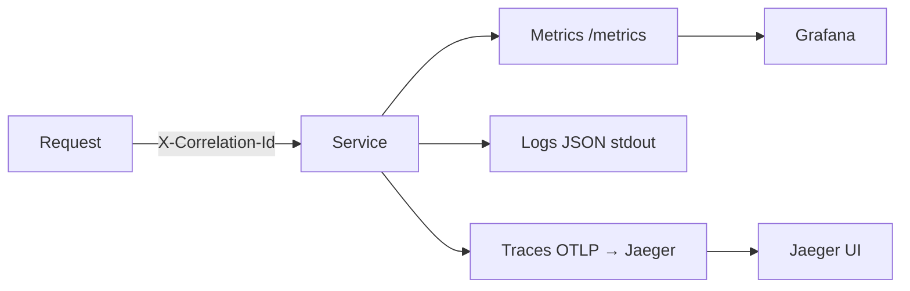

# Observability

You cannot operate what you cannot see. SDMP treats observability as a first-class platform concern:
**metrics, logs, and traces** are wired into every service, correlated by a single request id.

## The three pillars

| Pillar | Question it answers | Tool |
|--------|---------------------|------|
| Metrics | *Is the system healthy?* (rates, errors, durations) | Prometheus + Grafana |
| Logs | *What exactly happened?* | Structured JSON → stdout (Loki-ready) |
| Traces | *Where did the time go?* (across components) | OpenTelemetry → Jaeger |

## RED + USE

- **RED** (per request flow): **R**ate, **E**rrors, **D**uration.
- **USE** (per resource): **U**tilization, **S**aturation, **E**rrors.

The monolith exposes RED metrics automatically via ASP.NET Core + a custom metrics middleware.

## Correlation IDs

Every inbound request is assigned (or honors) an `X-Correlation-Id`. That id is:

1. attached to the active trace,
2. included in every structured log line,
3. echoed back in the response header.

This lets you pivot: see an error metric → find the log → open the full distributed trace.



## Try it

```bash
docker compose up -d --build
# generate some traffic
curl -H "X-Correlation-Id: demo-123" http://localhost:8080/api/v1/products
# then:
#  - Prometheus:  http://localhost:9090  (try: sum(rate(http_server_request_duration_seconds_count[1m])))
#  - Grafana:     http://localhost:3000
#  - Jaeger:      http://localhost:16686  (search service "sdmp-monolith")
```

## Tradeoffs

- High-cardinality labels (e.g. per-user) explode Prometheus memory — keep labels bounded.
- 100% trace sampling is great for learning but expensive in production — use tail/ratio sampling.
- Logs are the most expensive pillar at scale — prefer metrics for alerting, logs for forensics.
