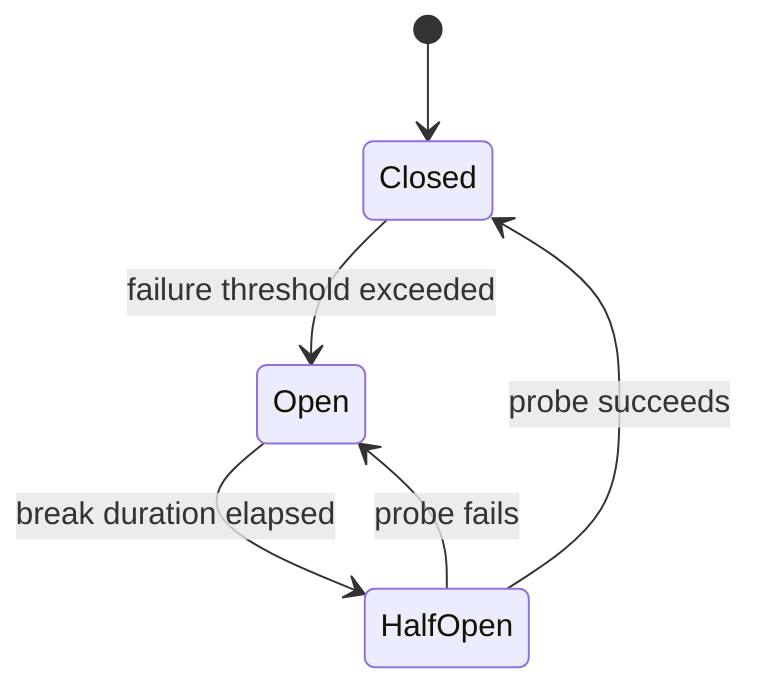

# Reliability

Reliability patterns keep a system responsive when its dependencies misbehave. In SDMP these are not
slides — they are implemented in the Phase 1 monolith and exercised by chaos labs.

## Patterns and where they live

| Pattern | Implementation | Chaos lab |
|---------|----------------|-----------|
| Retry + jittered backoff | `Reliability/ResiliencePipelines.cs` | Slow downstream |
| Timeout | `Reliability/ResiliencePipelines.cs` | Slow downstream |
| Circuit breaker | `Reliability/ResiliencePipelines.cs` | Downstream outage |
| Idempotency | `Reliability/IdempotencyMiddleware.cs` | Duplicate requests |
| Graceful shutdown | host lifetime + SIGTERM drain | Rolling restart |

### Idempotency store

The idempotency guarantee is only as good as where the keys are stored. The middleware depends on an
`IIdempotencyStore`:

- **In-memory** (default) — fine for a single instance.
- **Redis** — set `Idempotency:Provider=Redis`; keys (and replayed responses) are shared across every
  instance, so a retry routed to a *different* pod still replays rather than re-executes. This is how
  payment platforms guarantee a network retry never double-charges, regardless of which server
  handles it.

## The three paths

Every reliability concept demonstrates:

1. **Happy path** — the dependency is healthy; requests succeed with low latency.
2. **Failure path** — the dependency fails or slows; the pattern contains the damage.
3. **Recovery path** — the dependency heals; the system returns to normal automatically.

### Circuit breaker example

- **Closed:** requests flow; failures are counted.
- **Open:** requests fail fast without touching the dependency.
- **Half-open:** a limited number of probe requests test recovery.

## Metrics to watch

- `sdmp_dependency_call_duration_seconds` — latency distribution per dependency.
- `sdmp_circuit_breaker_state` — 0 closed, 1 half-open, 2 open.
- `sdmp_retries_total` — retry volume (a spike is an early warning).

## Tradeoffs

- Retries amplify load on an already-struggling dependency — always pair with a circuit breaker.
- Aggressive timeouts reduce tail latency but can turn slow successes into failures.
- Idempotency requires storing keys — bounded by TTL to avoid unbounded growth.
