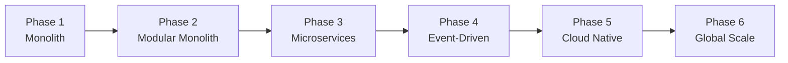

# Roadmap & Architectural Phases

SDMP evolves the **same domain** through six architectural phases. Each phase is a checkpoint that
demonstrates a major shift in distributed-systems thinking.

## Phase 1 — Monolith ✅ (implemented)

A single deployable ASP.NET Core service with clean internal boundaries.

- **Teaches:** clean architecture, vertical slices, the observability + reliability baseline every
  later phase inherits.
- **Code:** [services/monolith](../services/monolith/README.md)
- **Run:** `docker compose up -d --build`

What's included today:
- Minimal API with OpenAPI/Swagger
- `/health` (liveness + readiness) and `/metrics` (Prometheus)
- OpenTelemetry tracing exported to Jaeger
- Structured JSON logging with correlation IDs
- Reliability patterns: retry, timeout, circuit breaker, idempotency
- In-memory + Postgres-ready persistence abstraction
- Domain slices: Users, Products, Orders

## Phase 2 — Modular Monolith 🗺️

Split the monolith into bounded contexts (modules) with explicit contracts and in-process messaging.
Teaches: domain boundaries, the Outbox pattern in-process, anti-corruption layers.

## Phase 3 — Microservices 🗺️

Extract modules into independently deployable services behind an API Gateway + BFF.
Teaches: service decomposition, network failure modes, distributed tracing across services.

## Phase 4 — Event-Driven 🗺️

Introduce Kafka. Orders become event-sourced; cross-service workflows use the Saga pattern with the
Outbox for reliable publishing. Teaches: CQRS, event sourcing, eventual consistency, idempotent consumers.

## Phase 5 — Cloud Native 🗺️

Kubernetes + Helm + service mesh (Istio) + GitOps. Teaches: autoscaling, rollout strategies,
mTLS, traffic shifting, progressive delivery.

## Phase 6 — Global Scale 🗺️

Sharding, read replicas, multi-region active-active, edge caching/CDN, capacity planning.
Teaches: data partitioning, consistency at scale, regional failover.

---

## Suggested learning path

1. Run Phase 1 and explore `/swagger`, `/metrics`, Grafana, and Jaeger.
2. Read [docs/observability](observability/README.md) and watch a request flow through traces.
3. Read [docs/reliability](reliability/README.md) and trip the circuit breaker via a chaos lab.
4. Run a load test from [load-tests/](../load-tests/README.md) and watch autoscaling signals.
5. Follow the phases as they are implemented.
